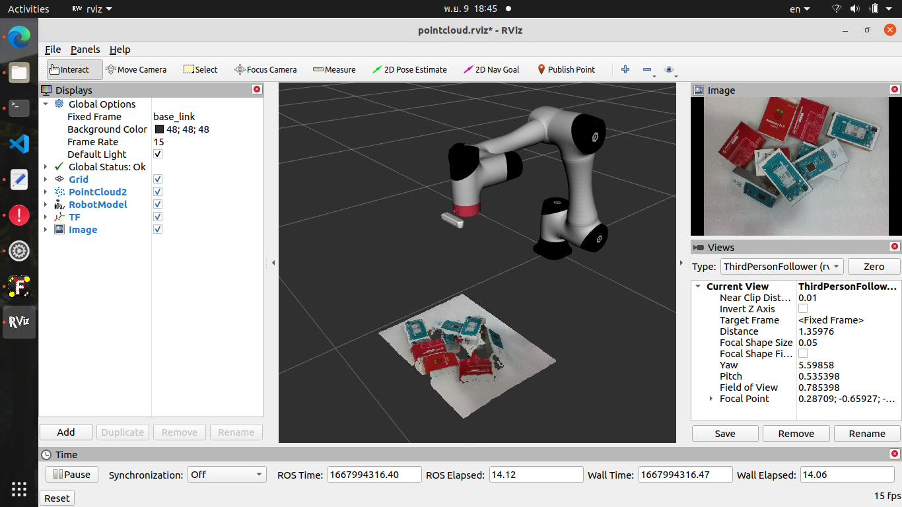

# <center>CR5_Project</center>

Dobot CR5 with Intel Realsense D435i for object detection and pose estimation (bin-picking application).

# Building

## ubuntu 20.04

### Use git to clone the source code
```sh
cd $HOME/catkin_ws/src
git clone https://github.com/monkeyrom/CR5_Project.git
cd $HOME/catkin_ws
```

### building
```sh
catkin_make
```
### set the dobot type
```sh
echo "export DOBOT_TYPE=cr5" >> ~/.bashrc
source ~/.bashrc
source $HOME/catkin_ws/devel/setup.bash
```

## 1.  Launch Project

* Connect the robotic arm with following command, and default robot_ip is 192.168.1.6 

```sh
    roslaunch CR5_Project CR5_with_realsense.launch
```

* this command will launch 
  - dobot_bringup
  - realsense camera pointcloud
  - find object 2d
  - tf synchronisation

### RVIZ Display

    
